# Request Processor Microservice - .NET 8

Este microservicio es responsable de recibir, registrar y notificar solicitudes de procesamiento de manera asíncrona. Está diseñado bajo principios de arquitectura limpia para ser mantenible, escalable y fácilmente integrable con otros sistemas.

## 🏗️ Arquitectura y Tecnologías

El proyecto implementa una **Arquitectura Hexagonal (Clean Architecture)** para desacoplar la lógica de negocio de las implementaciones de infraestructura.

*   **Framework:** .NET 8 Web API.
*   **Persistencia:** PostgreSQL con Entity Framework Core.
*   **Mensajería:** Azure Queue Storage (utilizando **Azurite** para emulación local).
*   **Validación:** FluentValidation para garantizar la integridad de los datos de entrada.
*   **Logging:** Serilog con sinks para Consola y Archivo.
*   **Contenedores:** Docker y Docker Compose para orquestación de servicios[cite: 1].
---
## 🚀 Ejecución Local

### Requisitos previos
*   Docker Desktop instalado.
*   Un cliente para pruebas API (Postman, Insomnia o el Swagger incluido).

### Pasos para iniciar
1. Clona este repositorio.
2. Asegúrate de que el puerto `8080` (API), `5432` (DB) y `10000-10002` (Azurite) estén libres.
3. Desde la raíz del proyecto, ejecuta:
   ```bash
   docker compose up --build
4. La API estará disponible en: http://localhost:8080/swagger
---
## ⚙️ Configuración (Variables de Entorno)
El sistema utiliza un archivo .env (o variables en el compose) con las siguientes claves principales:
*   **DB_HOST/DB_NAME/DB_USER/DB_PASSWORD:** Credenciales para la base de datos PostgreSQL[cite: 1].
*   **AZURE_STORAGE_CONNECTION_STRING:** Cadena de conexión dirigida al servicio de Azurite.
*   **AZURE_SERVICE_BUSS_CONNECTION_STRING:** Cadena de conexión dirigida al service bus  de Azure.
*   **MESSAGING_PROVIDER:** Proveedor de mensajeria (QueueStorage/ServiceBus)

---

## 📡 Endpoints Principales
*   **POST /api/requests:** Crea una nueva solicitud. Valida que el nombre y payload no sean nulos. Al crearse, se  emite un mensaje RequestCreated a la cola de Azure
*   **GET /api/requests/{id}:** Consulta el estado de una solicitud específica por su GUID
*   **GET /api/requests:** Retorna el listado histórico de todas las solicitudes
---

## ☁️ Despliegue en Azure

El microservicio se encuentra desplegado y disponible para pruebas en el siguiente entorno de producción:

*   **Endpoint Base:** https://request-api-app.lemonflower-9dbaf244.canadacentral.azurecontainerapps.io/swagger

> **Nota:** En el entorno de Azure, el sistema está configurado para utilizar **Azure Service Bus** como proveedor de mensajería, demostrando la capacidad de la arquitectura para cambiar de infraestructura sin afectar el dominio.

### Configuración en Azure Container Apps
Se han configurado los siguientes secretos y variables de entorno en la nube:
*   `ConnectionStrings__PostgresConnection`: Referencia a Secret (postgres-connection).
*   `ConnectionStrings__AzureServiceBus`: Referencia a Secret (azure-service-bus-connection).
*   `ConnectionStrings__AzureStorage`: (vacia, no se usa en ambiente azure)
*   `Messaging__Provider`: `ServiceBus`.
*   `Messaging__QueueName`: `request-created-queue`.

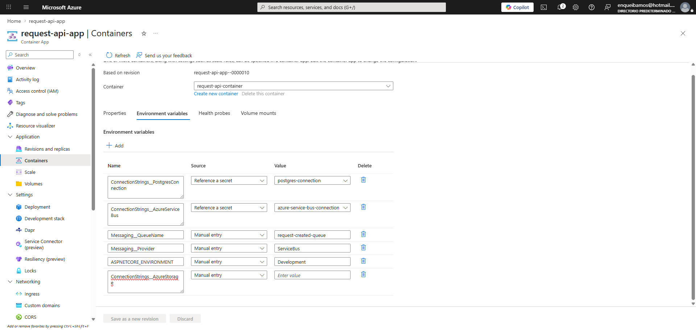
---

## 🛠️ Decisiones Técnicas Destacadas
**1. Result Pattern & BusinessException:** Se utiliza un patrón de resultados para el flujo de la aplicación, evitando el uso excesivo de excepciones para lógica de control y usando BusinessException solo para violaciones de reglas de dominio

**2. Desacoplamiento de Mensajería:** Mediante la interfaz IMessagePublisher, el sistema puede cambiar de Azure Queue Storage a Azure Service Bus con un cambio mínimo en la configuración de inyección de dependencias

**3. Compatibilidad con Azurite:** Se forzó la versión del servicio V2024_05_04 en el cliente de Azure Storage para garantizar la compatibilidad entre el SDK de .NET 8 y el emulador local.


---

## 🧪 Evidencias de Pruebas

### Ejecución en Entorno de Desarrollo (Local + Azurite)
1. Validación de logging
    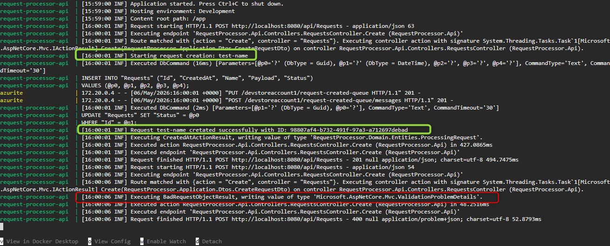

2. Flujo valido
* Creación del request (Create)
    
    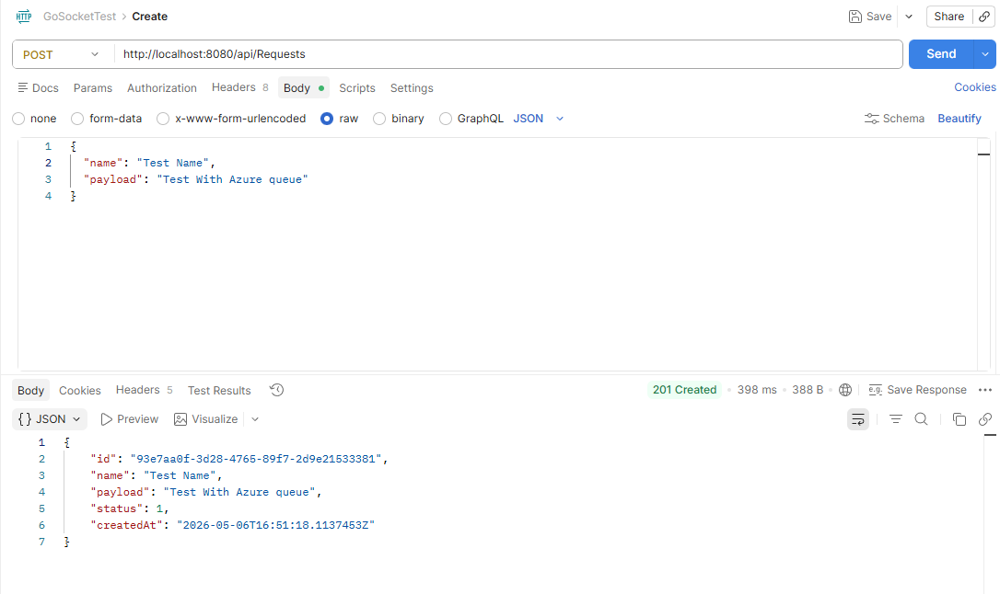
* Creación del mensaje en la cola

    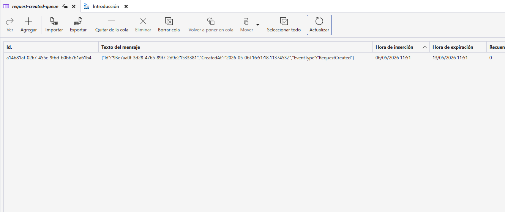

* Creación del registro en base de datos

    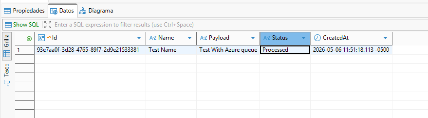

* Consulta del request (GetById)

    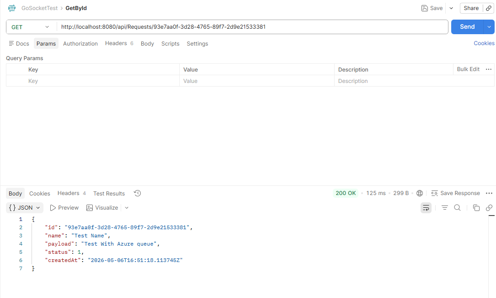

* Consulta de todos los request (GetAll)

    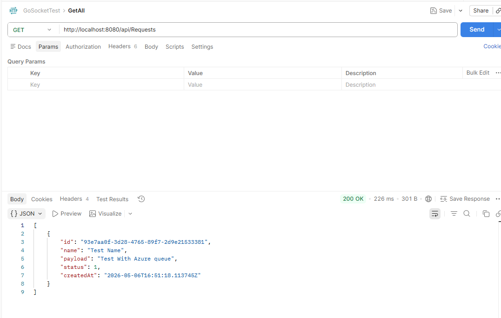

3. Pruebas Invalidas
* Creación con Request Incorrecto

    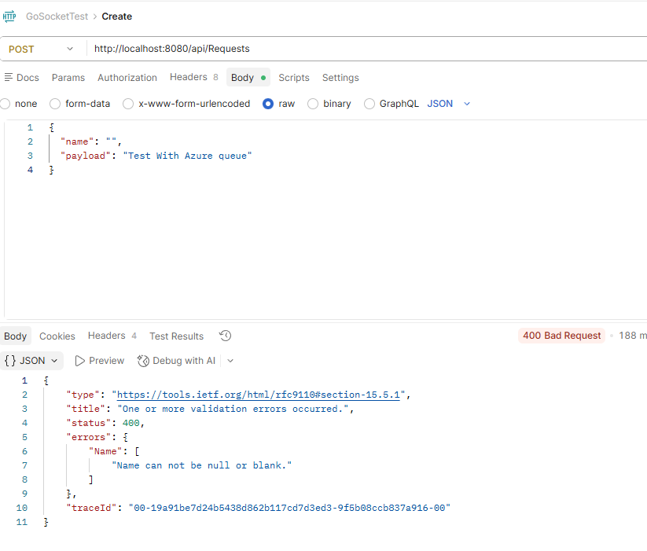

* Consulta de Request Inexistente

    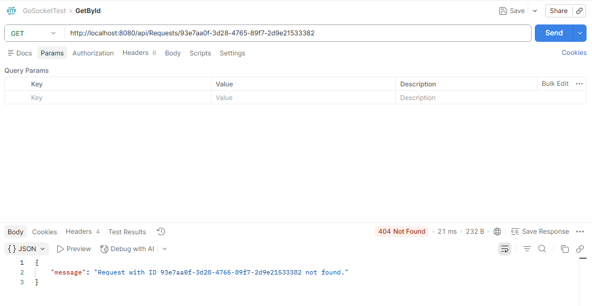

### Ejecución en Entorno Azure (Cloud)
1. Validación de logging
  
    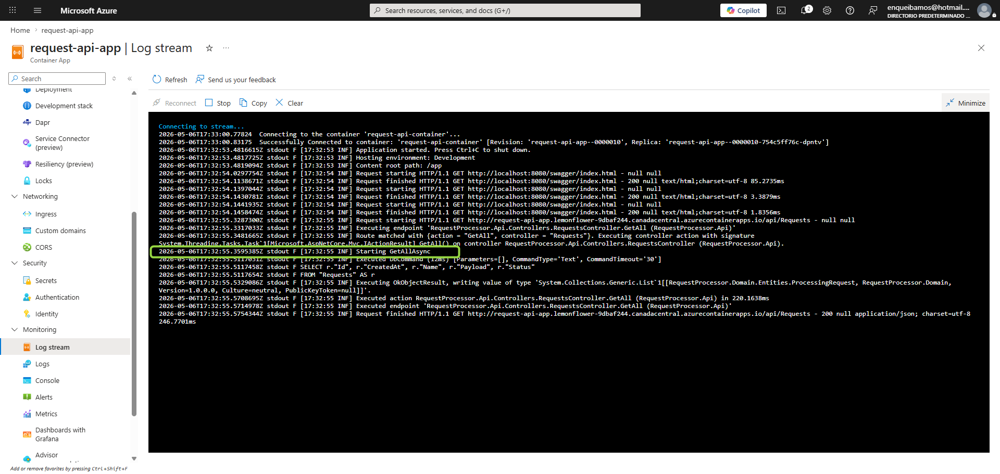

2. Validación de mensajes en Service Bus

* Validación de cola

    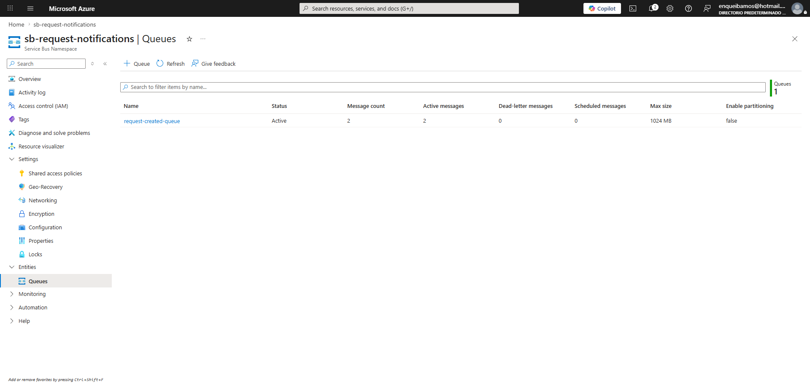

* Validación de mensajes

    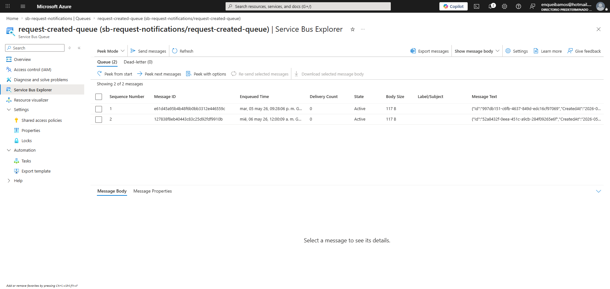

---

## ⏱️ Tiempos de Ejecución

A continuación se detalla el tiempo invertido en las diferentes fases del reto técnico:

| Fase | Actividad | Tiempo Estimado |
| :--- | :--- | :--- |
| **Análisis** | Diseño de arquitectura hexagonal y definición de dominio | 0.25 h |
| **Core** | Implementación de Entidades, Repositorios y Servicios| 1.0 h |
| **Infraestructura** | Configuración de DB, Azure Storage y Docker | 0.25 h |
| **Refactor** | Solución de compatibilidad de versiones (Azurite 400 Error) | 1.0 h |
| **DevOps** | Configuración de Azure Container Apps | 1.0 h |
| **Documentación** | README y preparación de evidencias | 1.0 h |
| **Total** | | **4.5 h** |

**Desarrollado por Juan Sebastian Cárdenas Gómez - 2026**
